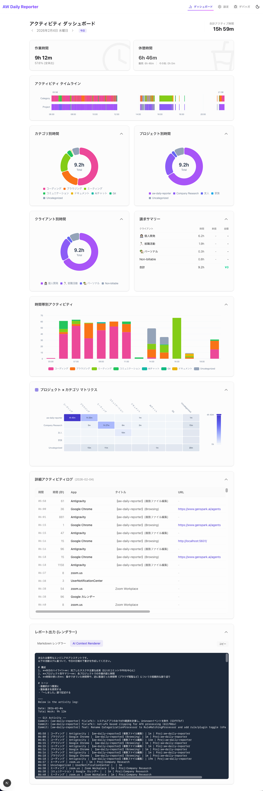

# aw-daily-reporter

[](https://github.com/aromarious/aw-daily-reporter/actions/workflows/ci.yml)
[](https://github.com/aromarious/aw-daily-reporter/actions/workflows/semgrep.yml)
[](https://github.com/aromarious/aw-daily-reporter/actions/workflows/secret-scanning.yml)

[English](./README.md) | **日本語**

ActivityWatchで収集したライフログを「プロジェクト×カテゴリ」の2軸で分類・可視化し、AIによる日報作成を支援するツールです。

- 📊 **2軸による自動分類**: 「どの案件で(Project)」「何をしたか(Category)」を自動で整理
- 📈 **直感的な可視化**: タイムラインや円グラフ、ヒートマップで日々の活動を詳細に分析
- 🤖 **AI日報ソリューション**: 1日の活動ログを最適化されたプロンプトに変換し、LLMによる日報作成を自動化

[ActivityWatch](https://activitywatch.net/) が収集した膨大な生データを、人間が理解しやすい形に集計・可視化し、最終的に LLM（ChatGPT / Claude / Gemini）に渡すためのドラフトを生成します。



---

## 🎯 目的と特徴

### 1. 2軸による整理 (Project × Category)

**「何のために（Project）」「どんな活動を（Category）」** 行ったかを分析し、可視化します。

- **Project (コンテキスト)**:
  - 勤務先 / 業務委託A,B,... / 個人開発 ...
  - ActivityWatchのVSCodeウォッチャーのプロジェクト名や、ウィンドウウォッチャーのタイトル、ブラウザウォッチャーのURLを対象に、正規表現で自動マッピング
- **Category (アクティビティ)**:
  - コーディング / ドキュメント作成 / MTG / コミュニケーション / ブラウジング ...
  - アプリ名やキーワードで自動分類

**「A案件のコーディング時間」** や **「B案件のMTG時間」** といった、実務に即した粒度での振り返りが可能です。

### 2. タイムラインの統合

散らばったログを1つのタイムラインに統合します。

- **Window**: アクティブなウィンドウタイトル
- **Browser**: Chrome/Safari 等の詳細なURLアクセスログ
- **Git**: その日に行ったコミットログ（リポジトリ自動検出）
- **GitHub PR**: 作成・更新したPull Requestの状態

### 3. データの可視化

集計結果は、ユーザーにとって直感的なグラフやチャートで表示されます。

- **Activity Timeline**: プロジェクトとカテゴリの2レーンで表示されるタイムライン
- **Pie Charts**: カテゴリ別・プロジェクト別の時間配分を一目で確認
- **Heatmap**: 「どのプロジェクト（縦軸）で、どんな作業（横軸）をしていたか」のマトリクス表示
- **Hourly Activity**: 時間帯ごとの活動量の推移

「どのプロジェクトにどのくらい時間を使ったか」「その内訳としてどんな作業（カテゴリ）をしていたか」を多角的に分析できます。

### 4. AIネイティブな出力

ダッシュボードで振り返った内容は、AIプロンプトとして出力可能。
これを LLM に貼り付けるだけで、「今日のハイライト」「時間配分」「反省点」を含んだ完成度の高い日報が生成されます。

---

## 🚀 主要機能 (Web UI)

```bash
aw-daily-reporter serve
```

ブラウザで `http://localhost:5601` にアクセスすると、以下の機能が利用できます：

- **Dashboard**:
  - 今日の活動の全体像をグラフで可視化。
  - タイムラインの詳細確認。
  - **Renderer Output**: AI用プロンプトの閲覧とコピー。
- **Configuration**:
  - **Rules**: カテゴリ分類ルールの追加・編集。
  - **Projects**: プロジェクトマッピング（正規表現）の定義。
  - **Clients**: クライアントごとの時給レート設定（請求額の目安算出）。
- **Interactive Editing**:
  - 未分類（Uncategorized）の項目をクリックして、その場でルールを作成可能。

---

## 📦 インストール

### 前提条件

- **ActivityWatch**: `aw-server` が動作していること。
- **Python**: 3.8 以上
- **Node.js**: Web UI のビルドに必要（配布パッケージを利用する場合は不要）

### 手順

```bash
git clone https://github.com/aromarious/aw-daily-reporter.git
cd aw-daily-reporter

# ビルドとインストール (仮想環境が作成されます)
poetry install
cd aw_daily_reporter/web/frontend
npm install
npm run build
```

---

## 📖 使い方

### 1. サーバーの起動 (推奨)

Web UI を起動して、ブラウザから利用します。

```bash
aw-daily-reporter serve
```

### 2. CLI でのレポート生成

コマンドラインでサクッと確認したい場合や、テキストファイルに出力したい場合に使用します。

```bash
# 今日のレポートを標準出力へ
aw-daily-reporter report

# クリップボードにコピー (macOS)
aw-daily-reporter report | pbcopy

# 端末にも出力しつつクリップボードにコピー
aw-daily-reporter report | tee /dev/tty | pbcopy

# 日付指定
aw-daily-reporter report --date 2024-02-07

# JSON形式でファイルに出力 (jsonレンダラを使用)
aw-daily-reporter report --renderer=json -o report.json

# レンダラの指定 (Markdown以外)
aw-daily-reporter report --renderer=ai

# 利用可能なレンダラ（プラグイン）の一覧確認
aw-daily-reporter plugin list
# 出力例: [Renderer] AI Context Renderer (aw_daily_reporter.plugins.renderer_ai.AIRendererPlugin)
# --renderer=ai のようにIDの一部または名前で指定できます。

---

## ⚙️ 設定

設定ファイルは `~/.config/aw-daily-reporter/config.json` に保存されますが、基本的には **Web UI の設定画面** から変更することを推奨します。

### 主な設定項目

- **System**: ActivityWatch の接続先、一日の開始時間（デフォルト 04:00）。
- **Break / Excluded Configs**: 休憩時間や集計除外とするカテゴリの定義。
- **AI Prompt**: AI レンダラーが使用するシステムプロンプト。
- **Note**: アプリケーション定義（ブラウザ・エディタ）は自動判別されるため、ユーザーによる設定は不要です。

---

## 📚 ドキュメント (Documentation)

- **詳細な仕様・アーキテクチャ**: [PROJECT.md](./PROJECT.md) および [docs/specs.md](./docs/specs.md)
- **開発ガイド**: [docs/development.md](./docs/development.md)

## License

MPL-2.0
