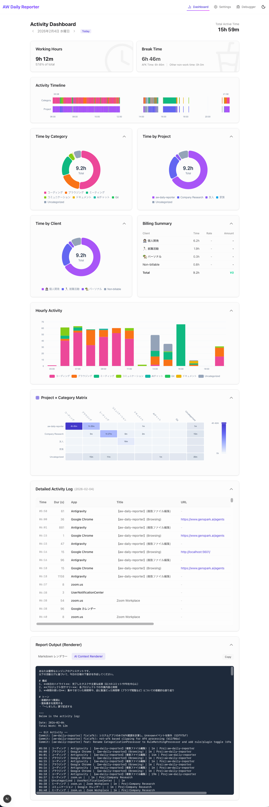

# aw-daily-reporter

[](https://github.com/aromarious/aw-daily-reporter/actions/workflows/ci.yml)
[](https://github.com/aromarious/aw-daily-reporter/actions/workflows/semgrep.yml)
[](https://github.com/aromarious/aw-daily-reporter/actions/workflows/secret-scanning.yml)

**English** | [日本語](./README.ja.md)

A tool that categorizes and visualizes life logs collected by ActivityWatch on two axes: "Project x Category", and supports AI-based daily report creation.

- 📊 **Automatic Classification by 2 Axes**: Automatically organizes "**For what purpose (Project)**" and "**What activity (Category)**" was performed.
- 📈 **Intuitive Visualization**: Detailed analysis of daily activities with timelines, pie charts, and heatmaps.
- 🤖 **AI Daily Report Solution**: Converts daily activity logs into optimized prompts and automates daily report creation using LLMs.

Aggregates and visualizes vast raw data collected by [ActivityWatch](https://activitywatch.net/) into a human-readable format, generating drafts optimized for LLMs (ChatGPT / Claude / Gemini).



---

## 🎯 Purpose and Features

### 1. Powerful Organization by 2 Axes (Project x Category)

Analyzes and visualizes **"For what purpose (Project)"** and **"What activity (Category)"** was performed.

- **Project (Context)**:
  - Work / Contract / Personal Dev...
  - Automatically mapped by regex from ActivityWatch VSCode watcher project names, window watcher titles, or browser watcher URLs.
- **Category (Activity)**:
  - Coding / Documentation / MTG / Communication / Browsing...
  - Automatically classified by app name or keywords.

Enables review at a practical granularity like **"Coding time for Project A"** or **"MTG time for Project B"**.

### 2. Timeline Integration

Integrates scattered logs into a single timeline.

- **Window**: Active window titles.
- **Browser**: Detailed URL access logs (Chrome/Safari etc.).
- **Git**: Commit logs for the day (automatic repository detection).
- **GitHub PR**: Created/Updated Pull Request status.

### 3. Data Visualization

Aggregated results are displayed in intuitive graphs and charts.

- **Activity Timeline**: Timeline displayed with Project and Category lanes.
- **Pie Charts**: Time allocation by Category and Project at a glance.
- **Heatmap**: Matrix display of "Which project (vertical axis) and what work (horizontal axis) was done".
- **Hourly Activity**: Activity trends by time of day.

Analyze "How much time was spent on which project" and "What work (category) was done as a breakdown" from multiple angles.

### 4. AI-Native Output

Review content from the dashboard can be output as an AI prompt.
Simply paste this into an LLM to generate a high-quality daily report including "Today's Highlights", "Time Allocation", and "Reflections".

---

## 🚀 Key Features (Web UI)

```bash
aw-daily-reporter serve
```

Access `http://localhost:5601` in your browser to use the following features:

- **Dashboard**:
  - Visualize today's activity overview with graphs.
  - Review timeline details.
  - **Renderer Output**: View and copy AI prompts.
- **Configuration**:
  - **Rules**: Add/Edit category classification rules.
  - **Projects**: Define project mappings (Regex).
  - **Clients**: Hourly rate settings per client.
- **Interactive Editing**:
  - Click on "Uncategorized" items to create rules on the spot.

---

## 📦 Installation

### Prerequisites

- **ActivityWatch**: `aw-server` must be running.
- **Python**: 3.8 or higher.
- **Node.js**: Required for building Web UI (not needed if using distributed package).

### Recommended: Install via pip

Copy the link to the latest `.whl` file from [Releases](https://github.com/aromarious/aw-daily-reporter/releases) and install it.

```bash
# Example
pip install https://github.com/aromarious/aw-daily-reporter/releases/download/vX.X.X/aw_daily_reporter-X.X.X-py3-none-any.whl
```

### Development: Build from Source

```bash
git clone https://github.com/aromarious/aw-daily-reporter.git
cd aw-daily-reporter

# Build and Install (creates a virtual environment)
poetry install

# Frontend Setup
# Corepack is recommended to use the specified pnpm version
corepack enable
cd aw_daily_reporter/web/frontend
pnpm install
pnpm run build
pnpm run lint   # Run Ultracite linter
```

---

## 📖 Usage

### 1. Start Server (Recommended)

Start the Web UI and use it from your browser.

```bash
aw-daily-reporter serve
```

### 2. Generate Report via CLI

Use for quick checks via command line or outputting to a text file.

```bash
# Today's report to stdout
aw-daily-reporter report

# Copy to clipboard (macOS)
aw-daily-reporter report | pbcopy

# Output to terminal and copy to clipboard
aw-daily-reporter report | tee /dev/tty | pbcopy

# Specify date
aw-daily-reporter report --date 2024-02-07

# Output to JSON file
aw-daily-reporter report --renderer=json -o report.json

# Specify renderer (other than Markdown)
aw-daily-reporter report --renderer=ai

# List available renderers (plugins)
aw-daily-reporter plugin list
# Output example: [Renderer] AI Context Renderer (aw_daily_reporter.plugins.renderer_ai.AIRendererPlugin)
# Specify by part of ID or name like --renderer=ai
```

---

## ⚙️ Configuration

Configuration file is saved at `~/.config/aw-daily-reporter/config.json`, but we recommend changing settings from the **Web UI Settings Screen**.

### Main Settings

- **System**: ActivityWatch connection destination, Start of day (default 04:00).
- **Break / Excluded Configs**: Break time and categories excluded from aggregation.
- **AI Prompt**: System prompt used by AI renderer.
- **Note**: Application definitions (Browser/Editor) are automatically detected, so user configuration is not required.

---

## 📚 Documentation

- **Detailed Specs/Architecture**: [PROJECT.md](./PROJECT.md) and [docs/specs.md](./docs/specs.md)
- **Development Guide**: [docs/development.md](./docs/development.md)

## License

MPL-2.0
