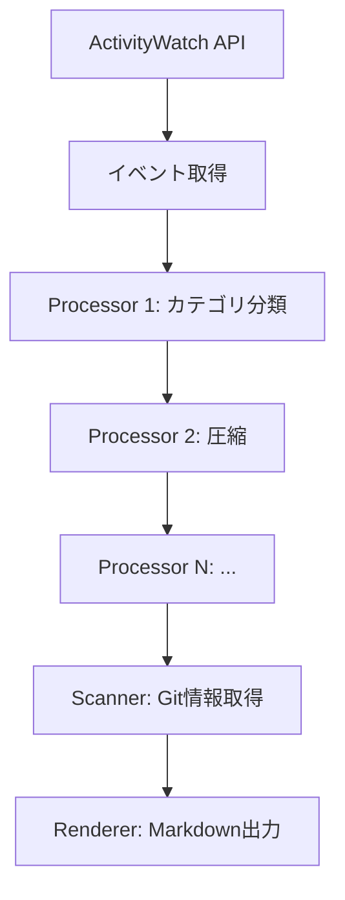
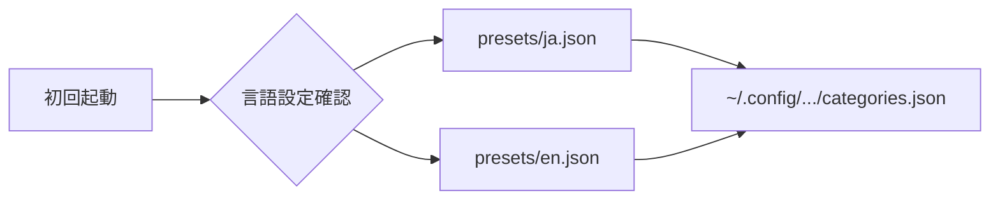

# 詳細設計書 (Specifications)

**プロジェクト**: aw-daily-reporter
**バージョン**: 0.2.0 (Draft)

---

## 1. 概要

aw-daily-reporter は ActivityWatch のデータを活用した日報・タイムライン生成ツールです。

### 1.1 主要機能

| 機能                   | 説明                                                     |
| :--------------------- | :------------------------------------------------------- |
| **タイムライン生成**   | ActivityWatch のデータを集約・加工してタイムラインを生成 |
| **プラグインシステム** | 処理・スキャン・レンダリングを拡張可能                   |
| **Web UI**             | ブラウザからプラグイン管理・設定編集                     |
| **レポート出力**       | Markdown 形式で日報を出力                                |

### 1.2 アーキテクチャ

```text
┌─────────────────┐     ┌──────────────────┐
│  ActivityWatch  │────▶│  aw-daily-reporter │
│  (aw-server)    │     │                  │
└─────────────────┘     │  ┌────────────┐  │
                        │  │ Processors │  │
                        │  ├────────────┤  │
                        │  │ Scanners   │  │
                        │  ├────────────┤  │
                        │  │ Renderers  │  │
                        │  └────────────┘  │
                        │        │         │
                        │        ▼         │
                        │  ┌────────────┐  │
                        │  │  Web UI    │  │
                        │  └────────────┘  │
                        └──────────────────┘
```

---

## 2. コマンドラインインターフェース (CLI)

### 2.1 メインコマンド

```bash
aw-daily-reporter [COMMAND] [OPTIONS]
```

### 2.2 サブコマンド

| コマンド | 説明                                     |
| :------- | :--------------------------------------- |
| `report` | タイムラインレポートを生成（デフォルト） |
| `serve`  | Web UI を起動                            |
| `plugin` | プラグイン管理                           |

### 2.3 report コマンド

```bash
aw-daily-reporter report [OPTIONS]
```

| オプション  | 短縮形 | デフォルト | 説明                        |
| :---------- | :----- | :--------- | :-------------------------- |
| `--date`    | `-d`   | 今日       | 集計対象の日付 (YYYY-MM-DD) |
| `--output`  | `-o`   | stdout     | 出力先ファイル              |
| `--format`  | `-f`   | markdown   | 出力形式 (markdown/json)    |
| `--verbose` | `-v`   | False      | 詳細ログ表示                |

### 2.4 serve コマンド

```bash
aw-daily-reporter serve [OPTIONS]
```

| オプション  | 短縮形 | デフォルト | 説明                     |
| :---------- | :----- | :--------- | :----------------------- |
| `--port`    | `-p`   | 5601       | Web UI のポート番号      |
| `--host`    |        | 127.0.0.1  | バインドするホスト       |
| `--no-open` |        | False      | ブラウザを自動で開かない |

### 2.5 plugin コマンド

```bash
aw-daily-reporter plugin [SUBCOMMAND]
```

| サブコマンド    | 説明                             |
| :-------------- | :------------------------------- |
| `list`          | インストール済みプラグイン一覧   |
| `install <URL>` | URL からプラグインをインストール |
| `remove <NAME>` | プラグインをアンインストール     |

---

## 3. Web UI

### 3.1 使用パターン

- **通常時**: CLI (`aw-daily-reporter report`) でレポートを出力するだけ
- **調整時**: カテゴリ分類がイマイチな時だけ `aw-daily-reporter serve` で Web UI を起動

Web UI は常時起動するデーモンではなく、必要な時にオンデマンドで起動する設計。

### 3.2 機能

| 画面               | 機能                                        |
| :----------------- | :------------------------------------------ |
| **ダッシュボード** | 今日/昨日のレポートプレビュー、統計情報     |
| **プラグイン管理** | 有効/無効の切り替え、設定編集、インストール |
| **カテゴリ設定**   | カテゴリルールの追加・編集・削除            |
| **レポート履歴**   | 過去のレポート閲覧                          |

### 3.2 プラグインデバッグ機能

- **出力プレビュー**: 各プラグインの処理結果を個別に確認可能
  - Processor: 入力データ → 出力データの差分表示
  - Scanner: 取得した外部データの一覧
  - Renderer: 生成されたレポートのプレビュー
- **パイプライン可視化**: データが各プラグインを通過する流れを表示
- **ライブプレビュー**: 設定変更時に即座にレポートに反映

### 3.3 技術スタック

- **バックエンド**: Flask または FastAPI
- **フロントエンド**: 軽量 (HTML + JS、フレームワークなし or htmx)
- **ポート**: 5601（ActivityWatch の 5600 と被らない）

---

## 4. プラグインシステム

### 4.1 プラグインの種類

| 種類          | 役割                                   | 実行タイミング         |
| :------------ | :------------------------------------- | :--------------------- |
| **Processor** | タイムラインデータを加工・変換         | データ取得後、順次実行 |
| **Scanner**   | 外部データを取得してタイムラインに追加 | Processor 完了後       |
| **Renderer**  | レポートを出力形式に変換               | 最終段階               |

### 4.2 ビルトインプラグイン

```text
aw_daily_reporter/plugins/
├── processor_rule_matching.py     # ルールマッチング（カテゴリ・プロジェクト）
├── processor_compression.py       # イベント圧縮
├── processor_project_mapping.py   # プロジェクト名マッピング
├── processor_project_propagation.py # プロジェクト情報伝播
├── scanner_git.py                 # Git コミット情報取得
└── renderer_markdown.py           # Markdown 出力
```

### 4.3 ユーザープラグイン

```text
~/.config/aw-daily-reporter/plugins/
├── my_custom_processor.py    # 自作プラグイン
└── third_party_renderer.py   # サードパーティ（手動配置）
```

### 4.4 プラグイン設定

`~/.config/aw-daily-reporter/plugins.toml`

```toml
[plugins]
enabled = [
    "processor_rule_matching",
    "processor_compression",
    "scanner_git",
    "renderer_markdown",
]

[plugins.scanner_git]
include_commit_message = true
max_commits_per_day = 50

[plugins.renderer_markdown]
output_dir = "~/Documents/daily-reports"
```

### 4.5 プラグイン開発

```python
from aw_daily_reporter.plugins.base import ProcessorPlugin

class MyProcessor(ProcessorPlugin):
    name = "my_processor"
    description = "カスタム処理を行うプラグイン"
    
    def process(self, timeline, config):
        # timeline を加工して返す
        return timeline
```

---

## 5. データ処理

### 5.1 処理フロー



### 5.2 タイムラインデータ構造

```python
@dataclass
class TimelineItem:
    start: datetime
    end: datetime
    duration: float  # 秒
    app: str
    title: str
    category: Optional[str]
    project: Optional[str]
    context: List[str]  # 追加情報
```

### 5.3 データソース

| バケット            | 用途                                         |
| :------------------ | :------------------------------------------- |
| `aw-watcher-window` | ベースとなるウィンドウ情報                   |
| `aw-watcher-afk`    | 離席判定                                     |
| `aw-watcher-vscode` | エディタ情報（プロジェクト、ファイル、言語） |
| `aw-watcher-web-*`  | ブラウザ情報（URL、タイトル）                |

---

## 6. 設定ファイル

### 6.1 メイン設定 (`~/.config/aw-daily-reporter/config.toml`)

```toml
[general]
language = "ja"
timezone = "Asia/Tokyo"

[activitywatch]
host = "127.0.0.1"
port = 5600

[report]
output_dir = "~/Documents/daily-reports"
```

### 6.2 言語別プリセット (`data/presets/{lang}.json`)

各言語用のカテゴリルールとローカライズされたカテゴリ名を提供。

```text
data/presets/
├── ja.json    # 日本語プリセット
├── en.json    # 英語プリセット
└── ...        # 他言語（コントリビューター追加）
```

#### プリセットの構造

```json
{
  "language": "ja",
  "categories": {
    "Coding": "コーディング",
    "Browsing": "ブラウジング",
    "Communication": "コミュニケーション"
  },
  "rules": [
    {"keyword": "google 検索", "category": "Browsing", "target": "title"},
    {"keyword": "code", "category": "Coding", "target": "app"}
  ]
}
```

### 6.3 ユーザー設定 (`~/.config/aw-daily-reporter/categories.json`)

初回起動時に選択した言語のプリセットがコピーされ、ユーザーが自由に編集可能。

### 6.4 初期化フロー

1. 初回起動時、`config.toml` の `language` 設定を確認
2. 対応する `presets/{lang}.json` を `~/.config/.../categories.json` にコピー
3. 以降はユーザー設定を使用



---

## 7. モジュール構成

```
aw_daily_reporter/
├── __init__.py
├── __main__.py           # CLI エントリーポイント
├── core.py               # メインロジック
├── timeline/
│   ├── generator.py      # タイムライン生成
│   └── models.py         # データモデル
├── plugins/
│   ├── base.py           # プラグイン基底クラス
│   ├── manager.py        # プラグイン管理
│   └── ...               # 各プラグイン
├── web/
│   ├── app.py            # Web UI アプリ
│   ├── routes.py         # API ルート
│   └── templates/        # HTML テンプレート
└── data/
    └── builtin_config.json
```

---

## 8. 多言語対応 (i18n)

### 8.1 対応言語

- 日本語 (ja)
- 英語 (en)

### 8.2 対象

- CLI のメッセージ・ヘルプテキスト
- Web UI のラベル・メッセージ
- レポート出力（カテゴリ名、見出し等）
- エラーメッセージ・ログ

### 8.3 実装

- gettext ベースの翻訳システム
- `aw_daily_reporter/i18n.py` で管理
- ロケールファイル: `locales/{lang}/LC_MESSAGES/messages.po`

---

## 9. 制約事項

| 項目                  | 制約                                                |
| :-------------------- | :-------------------------------------------------- |
| **Python バージョン** | 3.8 以上                                            |
| **データソース**      | ローカルの ActivityWatch サーバー（aw-client 経由） |
| **プラグイン形式**    | 単一 Python ファイル（Phase 1）                     |
| **Web UI ポート**     | 5601（ActivityWatch の 5600 と被らない）            |

### 9.1 パフォーマンス目標

| 処理                | 目標時間   |
| :------------------ | :--------- |
| 1日分のレポート生成 | 5秒以内    |
| Web UI の応答       | 500ms 以内 |

---

## 10. 将来の拡張（Phase 2）

以下は将来の実装候補として記録：

- **AI 連携**: タイムラインデータを AI に送信して日報を自動生成
- **週報/月報**: 複数日のデータを集計してトレンド分析
- **通知機能**: 作業時間の閾値超過時に通知
- **ActivityWatch UI 統合**: ActivityWatch の Web UI にタブとして統合
